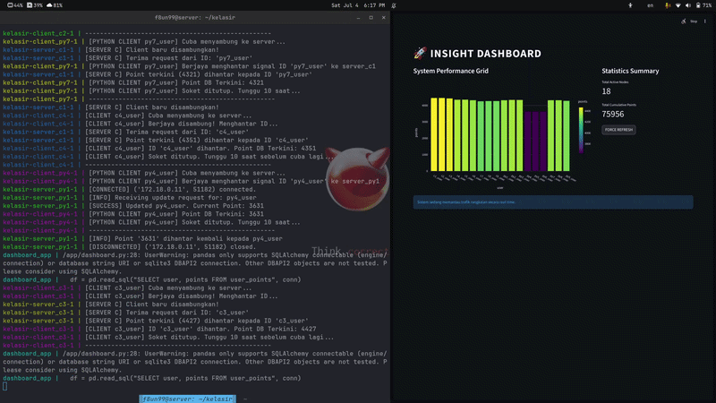

# Multi-Language Socket Communication and Horizontal Scaling in a Dockerized Infrastructure



This project demonstrates high-performance socket communication between different programming languages (C and Python) within a horizontally scalable Docker environment. 
*(Projek ini mendemonstrasikan komunikasi socket berprestasi tinggi antara pelbagai bahasa pengaturcaraan (C dan Python) di dalam persekitaran Docker yang sedia untuk digandakan / horizontal scaling).*

## 🚀 Features
* **Multi-Language Sockets:** Real-time raw data exchange between C and Python using TCP/UDP Sockets.
* **Horizontal Scaling:** Easily scale up containerized servers and clients to handle higher loads.
* **Dockerized:** Fully isolated services within a secure internal network (`socket_net`).
* **Cloudflare Tunnel:** Securely expose the local dashboard to the internet without port forwarding.

## 🏗️ Architecture
* **Dashboard:** Streamlit application (Python) for the user interface.
* **Database:** MySQL 8.0 for robust data logging.
* **Backend:** Scalable C and Python socket servers/clients.

## 💻 System Requirements (Keperluan Sistem)

Before proceeding, ensure your environment meets the following specifications to guarantee smooth cross-language compilation and network routing:
*(Sebelum bermula, pastikan persekitaran hos anda memenuhi spesifikasi berikut bagi menjamin kelancaran kompilasi silang bahasa dan penghalaan rangkaian:)*

* **Operating System (OS):** Ubuntu Linux (Recommended) / any Linux distribution with a modern kernel.
* **Containerization Engine:** Docker Engine v20.10+ & Docker Compose v2.20+.
* **Hardware Architecture:** x86_64 or ARM64 (ThinkPad setups tested successfully).
* **Network Allocation:** At least 1x internal Bridge Network (`socket_net`) and port `8501` open for local Dashboard access.
* **Compilation Base:** GNU Compiler Collection (GCC) for C compilation and Python 3.10+ (if running scripts locally outside Docker).


## ⚙️ How to Setup & Run (Cara Setup & Jalankan)

Follow these step-by-step instructions to initialize the multi-language socket architecture and test horizontal scaling.
*(Ikuti langkah demi langkah ini untuk memulakan seni bina soket pelbagai bahasa dan menguji penggandaan horizontal.)*

### Clone the Repository & Configure Token
*(Langkah 1: Klon Repositori & Konfigurasi Token)*

Clone your repository to your Linux host and insert your Cloudflare Tunnel Token into the `docker-compose.yml` file as stated in the architecture setup.
*(Klon repositori ke hos Linux anda dan masukkan Cloudflare Tunnel Token ke dalam fail docker-compose.yml seperti yang dinyatakan dalam tetapan seni bina.)*

```bash
git clone <your-repository-url>
cd <your-project-directory>
```
## 🌐 Alternative: Local Access (Without Cloudflare Tunnel)

If you prefer not to use Cloudflare Tunnel, you can bypass it entirely. Simply open your web browser and access the Dashboard directly using your server's IP address and port 8501:
👉 http://<your-server-ip>:8501 (e.g., http://192.168.1.50:8501)

(Jika anda tidak mahu menggunakan Cloudflare Tunnel, anda boleh terus membuka Dashboard melalui web browser menggunakan IP server anda dan port 8501: http://<ip-server-anda>:8501)
⚙️ Cloudflare Tunnel Setup (Subdomain Configuration)

## Cloudflare Tunnel Setup (Subdomain Configuration)

To expose the Dashboard to your own custom subdomain (e.g., supra.yourdomain.com), you must insert your Cloudflare Tunnel Token into the docker-compose.yml file.

(Untuk memaparkan Dashboard ke subdomain anda sendiri secara live, anda wajib memasukkan Cloudflare Tunnel Token anda ke dalam fail docker-compose.yml.)

    Open docker-compose.yml.

    Locate the tunnel service block.

 Replace YOUR_CLOUDFLARE_TOKEN with your actual token from the Cloudflare Zero Trust Dashboard.

```yaml
tunnel:
    image: cloudflare/cloudflared:latest
    restart: unless-stopped
    network_mode: "host" 
    environment:
      - TUNNEL_TOKEN=YOUR_CLOUDFLARE_TOKEN
    command: tunnel --no-autoupdate run
```

## Build

```bash
docker-compose up -d --build
```

### Monitoring Logs

When horizontal scaling is active, Docker automatically assigns an index number to each container replica (e.g., `client_py1`, `client_py2`, `client_c1`). You can choose to view the combined logs of all instances or isolate a single specific container for targeted troubleshooting.
*(Apabila horizontal scaling aktif, Docker secara automatik memberikan nombor indeks kepada setiap replika kontena (cth: `client_py1`, `client_c1`). Anda boleh memilih untuk melihat gabungan log kesemua instans atau memantau satu kontena spesifik sahaja untuk tujuan siasatan terperinci.)*

```bash
# Monitor Python clients 
docker-compose logs -f client_py1 (py1-py9)

# Monitor C clients 
docker-compose logs -f client_c1 (c1-c9)

# monitor all
docker compose logs -f
```


